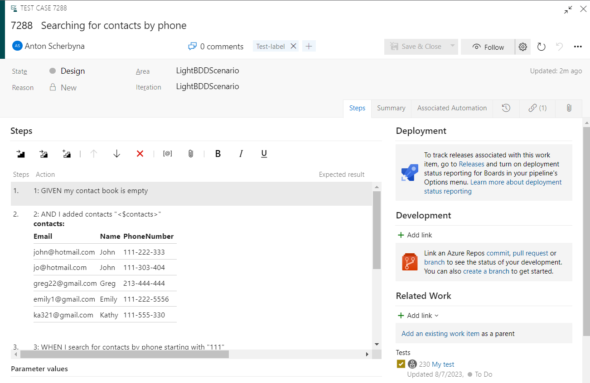

## The Light BDD test framework scenarios Azure DevOps import tool
To learn more, please see LightBDD.ScenarioSync wiki pages, or jump straight to:
* [Getting Started](https://github.com/khdevnet/LightBDD.ScenarioSync/wiki/Getting-started)
* [Scenario Sync CLI](https://github.com/khdevnet/LightBDD.ScenarioSync/wiki/ScenarioSync-CLI)
* See latest release details on [Releases](https://github.com/khdevnet/LightBDD.ScenarioSync/releases) page

## Project description
ScenarioSync for Azure DevOps, integrates the BDD process with Azure DevOps by connecting and synchronizing the LightBDD scenarios with Test Cases. 
ScenarioSync use LightBDD labels with "Relations:" metadata to assign Scenarios to Related Work Items in Azure DevOps.
ScenarioSync use LightBDD labels with "Sync:" metadata to link Scenario method to Test Case Associated Automation, that relation allow to run Automated Test Cases directly from Azure Devops Test Plan during release.
This way of the development reduce time spend to maintain actuality of scenarios in code and Azure DevOps.
ScenarioSync uses LightBDD FeaturesReport.xml file as a source and base on it creating Test suites and Test cases in Azure DevOps, Test suites and Test cases that not in source report removed from Azure DevOps.

## Light BDD to Azure DevOps Test Plan features mapping

| LightBDD                               | Azure DevOps Test Plan | Notes                                                                       |
|----------------------------------------|------------------------|-----------------------------------------------------------------------------|
| Feature                                | Test Suite             | Created as Test Suite                                                       |
| Feature Description                    | Test Suite Description | Saving to Test Suite Description                                            |
| Scenario                               | Test Case              | Created as Test Case                                                        |
| Scenario                               | Test Case Summary      | Saving as text rendered copy to Test Case description                       |
| Scenario Steps                         | Test Case Steps        | Created as Test Case Steps                                                  |
| Step File Attachment                   | Step Attachment        | Created Step Attachment                                                     |
| Step Table parameter                   | Step Parameters        | Not support Azure DevOps parameters, Saving as a text table in a step title |
| Step Tree parameter                    | X                      | Saving as a text in a step title                                            |
| Categories                             | Tags                   | Saving as Tags                                                              |
| Labels                                 | Tags                   | Saving as Tags                                                              |
| Comment                                | X                      | Saving to Test Case Description                                             |
| Step parameter expectation expressions | Step Expected Result   | Saving as Test case step expected result                                    |
| Step parameter expectation expressions | Step Expected Result   | Saving as Test case step expected result                                    |
| X                                      | Configurations         | Mapping not supported, can be applied to Static or Query based test suite   |
| Labels (Relations:)                    | Related Work           | Use Label attribute with text 'Relations:'                                  |
| Labels (Sync:)                         | Associated Automation  | Use Label attribute with text 'Sync:'                                       |

## Example
Use [Getting Started](https://github.com/khdevnet/LightBDD.ScenarioSync/wiki/Getting-started) to install and run import tool

### Light BDD Scenario
Example copied from Demo project [Contacts_management.cs](https://github.com/khdevnet/LightBDD.ScenarioSync.Demo/blob/main/Demo.LightBDD.XUnit2/Features/Contacts_management.cs).   
To assign scenario to related User Story or Task [RelationsAttribute](https://github.com/khdevnet/LightBDD.ScenarioSync.Demo/blob/main/Demo.LightBDD.XUnit2/Core/Attributes/RelationsAttribute.cs) attribute could be used. 
To include scenario to synchronization use [SyncAttribute](https://github.com/khdevnet/LightBDD.ScenarioSync.Demo/blob/main/Demo.LightBDD.XUnit2/Core/Attributes/SyncAttribute.cs).
```csharp
[Scenario]
[Label("Test-label")]
[Relations(234, 235)]
[Sync(nameof(Contacts_management), nameof(Searching_for_contacts_by_phone))]
// [Label("Relations:230,235")]
// [Label("Sync:Demo.LightBDD.XUnit2.dll;Demo.LightBDD.XUnit2.Features.Contacts_management.Searching_for_contacts_by_phone")]
public void Searching_for_contacts_by_phone()
{
    Runner.WithContext<ContactsManagementContext>().RunScenario(
        c => c.Given_my_contact_book_is_empty(),
        c => c.Given_I_added_contacts(Table.For(
            new Contact("John", "111-222-333", "john@hotmail.com"),
            new Contact("John", "111-303-404", "jo@hotmail.com"),
            new Contact("Greg", "213-444-444", "greg22@gmail.com"),
            new Contact("Emily", "111-222-5556", "emily1@gmail.com"),
            new Contact("Kathy", "111-555-330", "ka321@gmail.com"))),
        c => c.When_I_search_for_contacts_by_phone_starting_with("111"),
        c => c.Then_I_should_receive_contacts(Table.ExpectData(
            b => b.WithInferredColumns()
                .WithKey(x => x.Name),
            new Contact("Emily", "111-222-5556", "emily1@gmail.com"),
            new Contact("John", "111-222-333", "john@hotmail.com"),
            new Contact("John", "111-303-404", "jo@hotmail.com"),
            new Contact("Kathy", "111-555-330", "ka321@gmail.com")
        )));
}
```
### Azure DevOps Test Case

